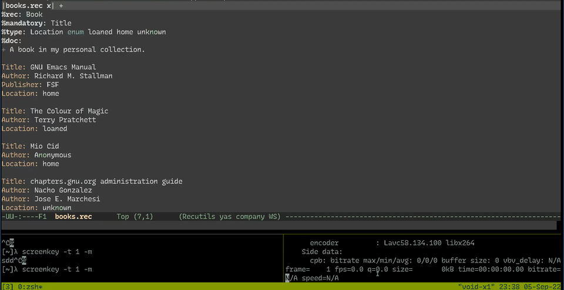

# Rec2-mode

A simplified rec-mode with some additional features. This mode leaves the buffer alone so
that it's always writeable, while providing additional features.




## Setup

Easiest way to install right now is to clone this repo somewhere and run `package-install-file` on the `rec2-mode.el` file. Then add this to your `init.el`:

```elisp
(require 'rec2-mode)
(setq auto-mode-alist (append '(("\\.rec$" . rec2-mode))))
```

## Shortcuts

| Shortcut   | Command    | Description |
|------------|------------|-------------
| `C-c C-f`  | `rec/fix`  | Runs `recfix` on buffer
| `C-c C-i`  | `rec/info` | Runs `recinf` on buffer
| `C-c C-l`  | `rec/filter-at-point` | Filters record based on key/value pair at cursor
| `C-c C-k`  | `rec/filter-keyword`  | Filters record based on keyword at cursor
| `C-c C-s`  | `rec/query` | Filters record based on provided query
| `M-j`      | `rec/string-nl` | `<CR>` with "+" appended for quick multi-line strings
| -          | `rec/to-table` | Creates an org-mode table of the record
| -          | `rec/template` | Runs a template file on key/value pair at cursor
| -          | `rec/snippet` | Creates a yasnippet template for the record based on metadata
